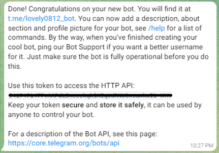
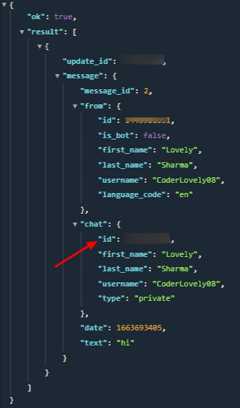

# Telegram Bot using python

We are going to build a simple Telegram bot using python which you can use to notify you about anything.

## Required Steps
1. [Create a telegram bot](#1-create-a-bot)
2. [Generate access token and save it somewhere](#2-generate-token)
3. [Generate chat id](#3-generate-chat-id)

## 1. Create a bot
1. Visit [Telegram](https://web.telegram.org/) and search for [BotFather](https://telegram.me/BotFather)
2. Type /start command
3. Type /newbot command, this will allow you to create a brand new bot for you. After which BotFather will prompt you to enter a name for your bot. Ex: MyNewbot

    

4. After that BotFather will prompt you to enter a unique username for your bot, note that username should end with 'bot' for ex: myBrandNewbot.
    
    

## 2. Generate Token
1. If the username is available you will receive a confirmation message with your special access toke like this
    
    

## 3. Generate Chat Id
1. Now open your browser and paste the following link
https://api.telegram.org/bot{token}/getUpdates?offset=-1
and replace the token section with your newly generated token.
Ex: Let's say your token is 123456:abcdefgh, your URL will look like
https://api.telegram.org/bot123456789:abcdefgh/getUpdates?offset=-1
and upon pasting this hit enter and you will receive a JSON response in your browser.
2. You will receive a response somethign like this
    
    

3. The arrow pointing towards a field will be your chat id.
4. Now replace your token and chat id in the main.py file and run the program. You will receive a mesage saying "Testing Telegram bot"
5. You must have received a message from your bot like this

    

### Congratulations you have succesfully created a automated Telegram bot using python, now do amazing stuff like sending hourly jokes or keep you updated with news headlines or literally anything. Explore what you can do with it and deploy it online.